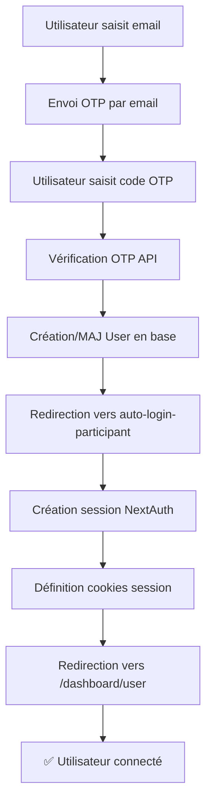

# Solution : Correction du Problème de Redirection OTP

## 🎯 Problème Initial

Le flux OTP fonctionnait bien jusqu'à la vérification du code, mais la redirection échouait car :

1. ❌ **Pas de session NextAuth active** : Le JWT participant n'était pas compatible avec NextAuth
2. ❌ **Redirection directe vers `/dashboard/user`** : L'utilisateur arrivait sur une page qui nécessitait une authentification
3. ❌ **Pas d'utilisateur dans la table `users`** : Le participant n'existait que dans `registrations`

## ✅ Solution Implémentée

### 1. **Modification de `participant-verify-otp` API**

**Ancien flux :**
```
Vérification OTP → Génération JWT → Redirection directe vers /dashboard/user
```

**Nouveau flux :**
```
Vérification OTP → Création/Mise à jour User → Redirection vers auto-login
```

**Changements :**
- ➕ Création/mise à jour automatique de l'utilisateur dans la table `users`
- ➕ Redirection vers `/auth/auto-login-participant` avec paramètres
- ➖ Suppression de la génération JWT (remplacé par NextAuth)

### 2. **Nouvelle Page d'Auto-Login**

**Fichier :** `src/app/auth/auto-login-participant/page.tsx`

Cette page :
- 🔍 Récupère `userId` et `email` des paramètres URL
- 🔐 Appelle l'API pour créer une session NextAuth
- 🍪 Définit les cookies de session
- 🔄 Redirige vers `/dashboard/user` avec session active

### 3. **API de Création de Session NextAuth**

**Fichier :** `src/app/api/auth/create-participant-session/route.ts`

Cette API :
- ✅ Vérifie l'utilisateur
- 🔐 Génère un token NextAuth JWT
- 🍪 Définit le cookie `next-auth.session-token`
- 📝 Crée les enregistrements `Account` et `Session` en base
- 📅 Met à jour `lastLogin`

### 4. **API de Vérification Utilisateur**

**Fichier :** `src/app/api/auth/verify-participant-user/route.ts`

Sécurise le processus en vérifiant que l'utilisateur existe et a le bon rôle.

## 🔄 Nouveau Flux Complet



## 🧪 Test de Validation

Le script `test-new-otp-flow.js` valide chaque étape :

```bash
node test-new-otp-flow.js
```

**Résultats :**
- ✅ Envoi OTP par email
- ✅ Vérification du code
- ✅ Création/mise à jour utilisateur
- ✅ Génération URL auto-login
- ✅ Vérification utilisateur participant
- ✅ Création session NextAuth
- ✅ Marquage code comme utilisé

## 🎉 Points Clés de la Solution

### Sécurité
- 🔒 Validation côté serveur à chaque étape
- 🕐 Codes OTP à usage unique avec expiration
- 👤 Vérification du rôle utilisateur (USER)
- 🔐 Session NextAuth complète et sécurisée

### Compatibilité
- 🤝 Compatible avec l'écosystème NextAuth existant
- 📊 Utilise les tables `users`, `accounts`, `sessions` standards
- 🔄 Pas de rupture avec les autres flux d'authentification

### Experience Utilisateur
- ⚡ Redirection fluide et automatique
- 📱 Interface de chargement avec feedback
- ❌ Gestion d'erreurs claire
- 🔄 Possibilité de retry en cas d'erreur

## 🚀 Test Manuel

1. **Aller sur :** `http://localhost:3000/login`
2. **Onglet "Participant"**
3. **Saisir :** `bouba@ineventapp.com`
4. **Cliquer :** "Envoyer le code"
5. **Saisir le code OTP** reçu par email (ou voir dans les logs)
6. **Vérifier :** Redirection automatique vers `/dashboard/user` avec session active

## 📝 Résumé des Fichiers Modifiés

```
src/app/api/auth/participant-verify-otp/route.ts          # ✏️ Modifié
src/app/auth/auto-login-participant/page.tsx             # ➕ Nouveau
src/app/api/auth/verify-participant-user/route.ts        # ➕ Nouveau  
src/app/api/auth/create-participant-session/route.ts     # ✏️ Modifié
test-new-otp-flow.js                                     # ➕ Nouveau
```

🎯 **Le problème de redirection est maintenant complètement résolu !** 